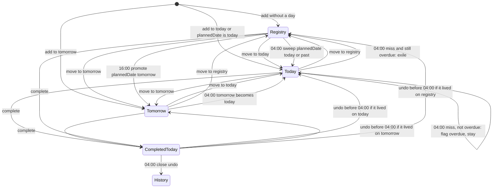

# stasks v1 PRD

**Status:** frozen for v1 functionality
**Audience:** implementation and design. This file is the behavior spec. Visual identity lives in `docs/PRODUCT.md` and `docs/DESIGN.md`. Changing look and feel must not rewrite these rules.

---

## 1. Problem

Tasks from shopping, cleaning, work, and everything else get delayed, forgotten, or sit pending with no honest split between:

- what I am actually doing **tomorrow** (or today)
- what I know I must do **sometime**, but have not committed to a day

There is no personal system that matches how I plan at night, capture during the day, forgive a miss once, then park work that slipped again.

## 2. Product

**stasks** is a single-user personal task tracker.

Every night before bed, I add the list I aim to complete tomorrow. Personal and Work sit in that same list as visual subsets. Anytime, I can park work in a **registry** without committing a day. If I have bandwidth, I move registry items onto today or tomorrow. Incomplete committed work gets an **overdue** reminder, one grace day on the board, then returns to the registry if I still miss it. Registry items can carry a **planned date**; they surface as upcoming, then auto-join tomorrow in the afternoon before that date.

The app also keeps a **streak** (at least one completion per logical day) and a small **stats** surface for history, progress, and motivation.

This is a personal tool. All accounts, hosting, and data stay on my personal GitHub, Vercel, and Neon. No RaftLabs accounts or resources.

## 3. Who

- **User:** Abhishek Jain only
- **Access:** Google login, allowlisted to my Gmail. No public signup
- **Devices:** iPhone and Mac, same data, via an installable PWA in the browser
- **Network:** required. No offline-first sync in v1

## 4. Goals

- Make nightly planning of tomorrow the main ritual, while still allowing adds to today
- Keep a durable registry of unscheduled work, including “do this in N days”
- Make misses visible (overdue) without punishing or deleting them
- Persist everything in a real database
- Motivate via streak + a tight stats set, including a GitHub-style heatmap
- Stay free on personal hobby/free tiers

## 5. Non-goals (v1)

- Recurring / repeating tasks
- User-created tags (system tags only: overdue, upcoming)
- Push or email notifications
- Offline-first or multi-device conflict sync beyond “online to the same server”
- Native iOS / App Store
- Multi-user, sharing, teams
- A browsable archive of all historical tasks beyond stats / heatmap
- Paste-a-list import (one title per line)
- Priority fields, due times within a day, subtasks, attachments
- AI suggestions or weekly review emails

## 6. Core concepts

| Concept | Meaning |
|---|---|
| **Logical day** | The app’s “today”, not always the calendar date. Cuts at 04:00 Asia/Kolkata. |
| **Today** | Work committed to the current logical day |
| **Tomorrow** | Work committed to the next logical day. Primary nightly planning surface |
| **Registry** | Unscheduled or later work. Optional planned date |
| **Category** | `personal` or `work`. Visual subsets inside a list, not tags |
| **Overdue** | System flag: this was missed on a committed day. Reminder, clearable |
| **Upcoming** | Derived tag on registry items whose planned date is 1–2 logical days away |
| **Completed today** | Finished during the current logical day. Undoable until 04:00 |

## 7. Screens (functional)

Visual design is out of scope here. These are the v1 surfaces:

1. **Today** — incomplete items for the current logical day, grouped Personal then Work (or equivalent visual subsets), plus a completed-today section for this logical day
2. **Tomorrow** — incomplete items for the next logical day, same category subsets
3. **Registry** — items not on Today or Tomorrow
4. **Stats** — streak, bars, split, rate, overdue count, heatmap

Auth gate: unauthenticated visitors see sign-in only. After Google login, if the email is not allowlisted, access is denied.

## 8. Task model

### 8.1 Fields

| Field | Required | Notes |
|---|---|---|
| Title | yes | Plain text. Shopping, cleaning, and work items are the same kind of object |
| Category | yes | `personal` \| `work` |
| Notes | no | Free text details |
| Location | yes | `today` \| `tomorrow` \| `registry` |
| Sort order | yes | Per list; used for drag-reorder |
| Overdue | yes | Boolean, default false. User-clearable. System may set it |
| Planned date | no | Calendar date. Meaningful on registry; see planned-date rules |
| Completed at | no | Set when completed; cleared on undo |
| Created at / updated at | yes | Timestamps |

Upcoming is **not stored**. It is derived from location + planned date + logical clock.

### 8.2 Identity

A task is one row for its whole life until deleted. Completing does not create a new task. Moving lists does not create a new task. History for stats is this same row (and/or an append-only completion/commitment log if implementation needs it; behavior below is normative).

## 9. Categories vs tags

- **Categories** are the two subsets of every list: Personal and Work. Every task has exactly one. They exist so I can see work vs personal in the same list without mixing them visually.
- **Tags in v1** are system-only: **overdue** and **upcoming**. I cannot add tags. We are not introducing user tags.

Dragging an item from the Personal subset into the Work subset (or the reverse) **changes its category**. That is still reorder-within-a-list, not a location move.

## 10. Capture

- Each category section (on Today, Tomorrow, and Registry) has an always-on add row
- I type a title, optionally notes, optionally a planned date (registry)
- Enter saves and focuses a new empty add row
- Category of a new item is the section I added it in
- I can add to Today and to Tomorrow, not only to Tomorrow
- Primary intended ritual: at night, fill Tomorrow

## 11. Reorder and moves

**Reorder:** drag to arrange items inside a list (Today, Tomorrow, or Registry). Order is stored and persists. Dragging between Personal and Work subsets on the same list changes category and order.

**Location moves** are explicit actions, not drag-across-lists:

- Move to Today
- Move to Tomorrow
- Move to Registry

Auto-moves still run at 04:00 (day roll + overdue exile) and 16:00 (planned-date promote). Those do not require me to open the app.

When moving Today/Tomorrow → Registry, planned date stays as-is unless I edit it (usually empty). Overdue, notes, and category are kept.

When moving Registry → Today or Tomorrow, planned date may remain as metadata; location is the list. Overdue is kept if it was on.

## 12. Logical clock

- **Timezone:** `Asia/Kolkata` (IST, UTC+05:30)
- **Day cut:** 04:00 in that timezone

```
logicalDate(now):
  local = now in Asia/Kolkata
  if local.hour < 4:
    return calendar date of local minus 1 day
  return calendar date of local
```

Examples:

- Tuesday 03:59 IST → logical date is Monday
- Tuesday 04:00 IST → logical date is Tuesday
- Planning at 01:00 is still “last night”; Tomorrow means the coming daytime

**Today** = tasks with location `today` for `logicalDate(now)`
**Tomorrow** = tasks with location `tomorrow` (the logical date after `logicalDate(now)`)

Streaks, overdue rollover, upcoming, and promote jobs all use this clock. Do not use UTC midnight.

## 13. Overdue

Overdue is a reminder that committed work was missed. I can clear it on any item, including in the registry.

### 13.1 Rules

At **04:00** logical-day rollover, for each still-incomplete task on **Today**:

1. If `overdue === false`: set `overdue = true` and keep it on the board. It becomes part of the **new** Today (merged with what was Tomorrow). This is the grace day.
2. If `overdue === true`: move to **Registry**, keep `overdue = true`. Exile.

Clearing overdue at any time sets `overdue = false`. That means “I still want this on the daily lists; do not exile it at the next 04:00.” If I then miss it again, 04:00 sets overdue back to true and I get **one more grace day**. I can repeat this indefinitely. Auto-exile happens only when a logical day ends with the task still incomplete **and** overdue still true.

Completing a task clears the live list; overdue on a completed task is irrelevant. If I undo complete before 04:00, restore the previous overdue value.

Delete is not overdue handling; delete removes the task.

### 13.2 What overdue is not

- Not a due date
- Not a separate list
- Not automatic deletion
- Not applied to brand-new registry items that were never committed to Today/Tomorrow

## 14. Planned date and upcoming

Planned date is how I say “I intend to do this on date D” while leaving it in the registry until it is time to commit.

Let `T` = current logical date, `D` = planned date (calendar date, compared as logical dates).

### 14.1 Upcoming (derived)

Show **upcoming** when:

- location is `registry`, and
- `D` is set, and
- `D` is **1 or 2** logical days after `T` (tomorrow or the day after)

Do not show upcoming when `D` is 3+ days away, in the past, or equal to `T` (those cases should not stay in the registry; see insert rules).

### 14.2 16:00 promote

At **16:00 Asia/Kolkata** every day:

- Every registry item with `D === T + 1` (planned date is tomorrow) moves to **Tomorrow**

Example: `D` = Friday. Wednesday: upcoming in registry. Thursday before 16:00: still registry, upcoming. Thursday 16:00: on Tomorrow (Friday’s list).

### 14.3 On create or update of planned date

Apply immediately, do not wait for cron:

| Planned date D | Current time | Result |
|---|---|---|
| unset | any | Registry (if that is the target location) |
| `D === T` (today) | any | **Today** immediately |
| `D === T + 1` (tomorrow) | local time ≥ 16:00 | **Tomorrow** immediately |
| `D === T + 1` | local time < 16:00 | Registry, upcoming |
| `D >= T + 2` | any | Registry; upcoming if `D === T + 2` |
| `D < T` (past) | any | Treat as today: move to **Today** (the date already arrived) |

### 14.4 04:00 sweep (safety)

At rollover, after list rotation:

- Registry items with `D ===` new `T` → Today (missed or skipped the previous 16:00 promote)
- Registry items with `D <` new `T` → Today

## 15. 04:00 rollover (full)

Runs at 04:00 Asia/Kolkata. Order:

1. Close the completed-today undo window for the logical day that just ended. Those completions are history. Uncomplete is no longer allowed for that day.
2. For incomplete **Today** items:
   - `overdue === true` → Registry, keep overdue
   - `overdue === false` → set overdue true; these remain on the live board
3. All **Tomorrow** items become **Today**. Merge with leftover items from step 2 (the newly overdue grace items). Preserve each item’s sort order within category; concatenate Tomorrow’s order after (or with) leftovers in a stable, documented way: **grace leftovers keep their relative order, then former Tomorrow items keep theirs**, per category.
4. **Tomorrow** is now empty.
5. Run planned-date sweep (section 14.4).
6. Recompute derived upcoming on remaining registry items.
7. Streak: the logical day that just ended counts if it had ≥1 completion. If zero completions, current streak resets to 0.

Cron must run whether or not I have the app open. Opening the app may also apply any missed run (idempotent catch-up) so a failed cron cannot leave the board stuck on yesterday.

## 16. Complete vs delete

**Complete**

- Item leaves the incomplete list
- Appears in **completed today** for the current logical day (still grouped Personal / Work)
- Counts for streak and stats
- Undo (uncomplete) allowed until the next 04:00
- After 04:00, that completion is history; no undo from the Today screen

**Delete**

- Task is removed
- Does not count for streak or stats
- Used for mistakes, not for “I didn’t do it”

There is no v1 archive browser of all past tasks. Stats and the heatmap use completion history.

## 17. Streak

- A logical day is a **streak day** if at least one task was completed during that logical day (completion timestamp mapped through `logicalDate`)
- Completing from Today, Tomorrow, or Registry all count
- Current streak = consecutive streak days ending at the current logical day if today already has a completion, otherwise ending at yesterday (so the streak does not break at 09:00 before I have done anything yet)
- If yesterday was not a streak day, current streak is 0, unless today already has a completion, in which case current streak is 1
- Best streak = max consecutive streak days in history

## 18. Stats (v1)

One Stats screen:

- Current streak and best streak
- Completions last 7 logical days and last 30 logical days (simple counts per day, shown as bars)
- Personal vs Work split of those completions
- **Completion rate:** for each logical day, `completed / items that sat on Today that day`. “Sat on Today” includes items that started on Today, rolled onto Today, or were added to Today that day, whether or not they were later moved or exiled. Implementation may persist a daily snapshot or equivalent event log; the definition is what matters
- Current overdue count: incomplete tasks with `overdue === true` (any location)
- **Heatmap:** GitHub-style calendar, about 12 months, one cell per logical day, intensity by number of completions that day (zero = empty)

No weekly email, no AI insights, no extra metrics in v1.

## 19. State machine



## 20. Typical flows

**Night planning:** open Tomorrow, add rows under Personal and Work, drag into pick order. Optionally pull from Registry via Move to Tomorrow.

**Daytime extra:** add to Today, or complete something unplanned from Registry (counts for streak).

**Will not pick today:** Move to Registry (overdue kept if it was on).

**Do this in five days:** add to Registry with planned date. Two days before: upcoming. Day before at 16:00: appears on Tomorrow.

**Missed yesterday:** item is on Today with overdue. I either do it, clear overdue to keep it another cycle, or ignore it and at next 04:00 it goes to Registry still overdue.

## 21. Stack (implementation later)

Documented now so hosting and data assumptions stay aligned. Not built in the PRD step.

- **App:** Next.js App Router, TypeScript
- **DB:** Neon Postgres, Drizzle ORM
- **Auth:** Auth.js, Google provider, allowlist of one email
- **Host:** Vercel Hobby, personal account
- **Jobs:** Vercel Cron at 04:00 and 16:00 Asia/Kolkata, plus idempotent catch-up on app load
- **Git:** private repo `stasks` on personal GitHub
- **Client:** installable PWA, network required
- **Cost:** free tiers only

## 22. Out of scope for this document

- Visual design, motion, color, typography, component library
- Design system application (see `docs/PRODUCT.md` and `docs/DESIGN.md`; already written)
- Database schema DDL, API routes, folder structure
- Exact completion-rate snapshot table design (must match section 18)

Schema, API, and folder structure belong in `docs/plans/MASTER.md`, not here.

## 23. Acceptance (v1 product, not this file)

Functionality is done when:

- I can sign in with the allowlisted Google account only
- I can manage Today, Tomorrow, and Registry with Personal/Work subsets, add rows, notes, drag-reorder, and explicit moves
- 04:00 and 16:00 rules match sections 12–15 even if I never opened the app
- Overdue grace and clear-to-keep behave as in section 13
- Planned date / upcoming / promote match section 14
- Complete / undo-until-04:00 / delete match section 16
- Streak and stats match sections 17–18
- Data persists in Neon across phone and Mac

Design quality is a later gate and does not change these rules.
