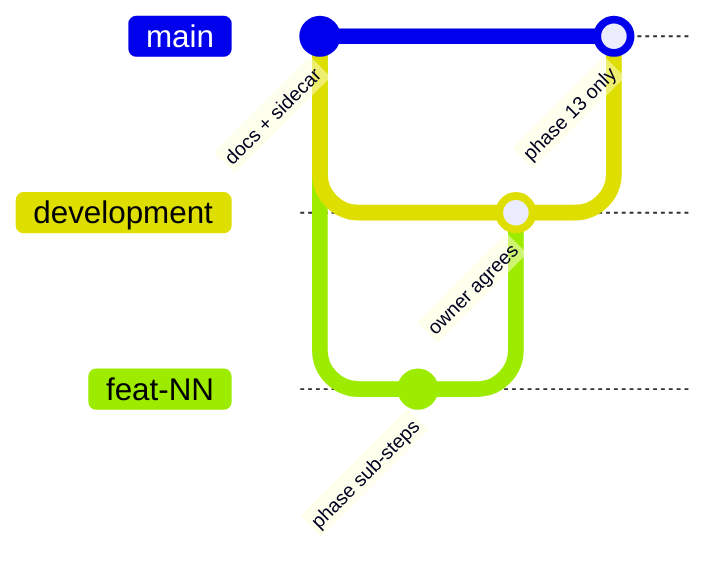

# Phase Plan: stasks v1

**Goal:** Ship a personal, installable PWA on Abhishek’s GitHub / Vercel Hobby / Neon that matches frozen `docs/PRD.md` behavior and `docs/DESIGN.md` UI for nightly Today / Tomorrow / Registry planning, overdue grace, planned-date promote, streak, and stats.

**Acceptance criteria:**

- Allowlisted Google sign-in only; everyone else is denied (`docs/PRD.md` §3, §7, §23).
- Today, Tomorrow, and Registry lists with Personal then Work subsets, always-on add rows, notes, drag-reorder (including Personal ↔ Work category change), and explicit Move to Today / Tomorrow / Registry (`docs/PRD.md` §7–11, §23).
- Logical clock is `Asia/Kolkata` with a 04:00 cut; streaks, overdue, upcoming, and jobs use it — never UTC midnight (`docs/PRD.md` §12).
- 04:00 rollover and 16:00 promote match `docs/PRD.md` §13–15 even if the app is closed; opening the app runs idempotent catch-up.
- Overdue grace, clear-to-keep, and exile match `docs/PRD.md` §13.
- Planned date, upcoming (derived), immediate insert rules, 16:00 promote, and 04:00 sweep match `docs/PRD.md` §14.
- Complete, undo until next 04:00, and delete match `docs/PRD.md` §16.
- Streak and Stats (7/30 bars, Personal/Work split, completion rate, overdue count, ~12-month heatmap) match `docs/PRD.md` §17–18.
- Data persists in Neon across iPhone and Mac (`docs/PRD.md` §3, §23).
- Screens use `docs/DESIGN.md`: CSS variables from that file, Nunito 400/800 via `next/font`, lip buttons, 2px Swan outlines, Polar/Snow/Eel, Personal Feather / Work Macaw, labeled overdue/upcoming chips, empty-state SVGs, motion tokens, `prefers-reduced-motion`.
- Vercel Cron at 04:00 and 16:00 Asia/Kolkata on a personal Hobby project. No RaftLabs accounts.

PRD + DESIGN are frozen. Behavior conflicts → PRD. UI conflicts → DESIGN.md. Recorded conflicts are under **Conflicts (resolved)** below.

---

## Constraints for every implementor

- Personal GitHub, Vercel, Neon, Google Cloud OAuth only. NEVER RaftLabs orgs, emails, or billing.
- Do not add v1 features the PRD lists as non-goals (recurrence, notifications, offline-first, user tags, dark mode, Duo, Feather Bold, DIN Next Rounded, Google Fonts CDN at runtime).
- Do not change `docs/PRD.md`, `docs/PRODUCT.md`, `docs/DESIGN.md`, `docs/README.md`, or move `.impeccable/design.json`.
- One master-plan phase per `feat/NN-slug` from `development`. Sub-steps = separate commits. Stage specific paths. Never `git add -A`. Never `--no-verify`. Never push unless this phase is deploy.
- Skills to read in implementor sessions: `next-best-practices`, `vercel-react-best-practices`, impeccable context from `docs/PRODUCT.md` + `docs/DESIGN.md` (do not run `impeccable teach`; PRODUCT.md exists), `emil-design-eng` for motion. Ignore any generic Vercel auth skill that recommends Clerk/Auth0 — PRD locks **Auth.js + Google allowlist**.
- If Next.js generates `proxy.ts` instead of `middleware.ts`, follow current Next docs. Do not use Pages Router.

---

## Git

```text
main          ← stable; merge here only in Phase 13 (deploy/release)
  └── development   ← integration; create from main if missing
        └── feat/NN-slug   ← one master-plan phase
```



As of this plan: `main` exists with **no commits**. Phase 1 makes the first commit (frozen docs + `.impeccable/`), then creates `development`, then `feat/01-scaffold`.

When a phase is done and the owner agrees: merge `feat/NN-slug` into `development` (no force). Leave `main` until Phase 13.

---

## Target tree (all phases share this)

Do not invent extra product surfaces. Names may shift slightly to match `create-next-app`, but responsibilities must not.

```text
app/
  layout.tsx                 # Nunito, CSS variables, PWA metadata
  page.tsx                   # redirect → /today or /signin
  globals.css                # DESIGN.md tokens as CSS variables
  manifest.ts
  (app)/                     # session required
    layout.tsx               # catch-up, header streak pill, nav
    today/page.tsx
    tomorrow/page.tsx
    registry/page.tsx
    stats/page.tsx
  (auth)/
    signin/page.tsx
    denied/page.tsx
  api/auth/[...nextauth]/route.ts
  api/cron/rollover/route.ts
  api/cron/promote/route.ts
components/
  buttons/lip-button.tsx
  nav/app-nav.tsx            # bottom bar <1024px; 72px left rail ≥1024px
  tasks/task-row.tsx
  tasks/add-row.tsx
  tasks/task-list.tsx
  empty-states/*.svg
lib/
  db/index.ts
  db/schema.ts
  auth.ts
  logical-clock.ts
  upcoming.ts
  streak.ts
  occupancy.ts
  jobs/rollover.ts
  jobs/promote.ts
  jobs/catch-up.ts
  actions/                   # server actions for mutations
drizzle.config.ts
drizzle/
public/icons/
licenses/OFL-Nunito.txt
vercel.json
.env.example
```

**CSS variables** in `app/globals.css` must include the full `docs/DESIGN.md` palette, type scale (§3, not only YAML frontmatter), radii, spacing, lip shadows, and motion tokens (`motion-none`, `motion-press` 150ms, `motion-state` 200–250ms, `motion-celebrate` 400–600ms, reduced-motion overrides). Map Tailwind `@theme` to those variables if Tailwind is used; DESIGN.md values stay canonical.

**PWA:** installable, **online-only**. Manifest + icons + `apple-web-app` metadata. Any service worker MUST be network-only for documents and API (no offline shell, no background sync).

---

## Data model (Phase 3 creates; later phases fill behavior)

Single-user, but every row is scoped to the Auth.js `users.id` for the allowlisted account.

**Auth.js (Drizzle adapter):** `users`, `accounts`, `sessions`, `verificationTokens` as required by the adapter.

**`tasks`**

| Column | Type | Notes |
|---|---|---|
| `id` | uuid pk | One row for the task’s life until delete |
| `userId` | uuid fk | Session user |
| `title` | text | Required |
| `category` | `personal` \| `work` | Required |
| `notes` | text null | |
| `location` | `today` \| `tomorrow` \| `registry` | Kept while completed; incomplete queries filter `completedAt is null` |
| `sortOrder` | int | Per (`location`, `category`). Append to end on move-in. Reindex 0..n-1 after reorder/rollover |
| `overdue` | boolean default false | User-clearable; system may set |
| `plannedDate` | date null | Calendar date; registry-oriented; rules in PRD §14 |
| `completedAt` | timestamptz null | Set on complete; cleared on undo |
| `overdueAtComplete` | boolean null | Snapshot so undo restores overdue |
| `createdAt` / `updatedAt` | timestamptz | |

**`completion_events`** (append-only for stats/streak; undo before 04:00 deletes the event)

| Column | Type | Notes |
|---|---|---|
| `id` | uuid pk | |
| `userId` | uuid | |
| `taskId` | uuid | May outlive a later delete of the task row if we retain the event after undo window closes. v1: on delete of a still-undoable completed row, delete today’s event (mistake). After 04:00, keep the event even if the task row is gone — so **on delete after undo window, do not remove `completion_events`**. Incomplete delete: no event. |
| `completedAt` | timestamptz | |
| `logicalDate` | date | `logicalDate(completedAt)` |

**`today_occupancy`** (completion-rate denominator, PRD §18)

Unique (`userId`, `logicalDate`, `taskId`). Insert when a task **enters Today** on that logical date: add to Today, move to Today, 04:00 leftover/grace stay, Tomorrow → Today, planned-date sweep/insert onto Today. Do not remove if later moved or exiled.

**Completion rate for logical date D:** count of occupancy rows for D whose `taskId` has a `completion_events` row with `logicalDate = D`, divided by occupancy count for D. Completions from Tomorrow/Registry that never sat on Today that day count for **streak** only, not this rate (avoids rate > 1).

**`job_runs`**

| Column | Type | Notes |
|---|---|---|
| `jobName` | `rollover-04` \| `promote-16` | |
| `logicalDate` | date | For rollover: the **new** T after the cut (the day that just began). For promote: T on which 16:00 ran |
| `ranAt` | timestamptz | |
| unique | (`jobName`, `logicalDate`) | Idempotency |

---

## Env vars (names only; never commit values)

| Name | Needed by | Purpose |
|---|---|---|
| `DATABASE_URL` | Phase 3+ | Neon Postgres |
| `AUTH_SECRET` | Phase 2+ | Auth.js |
| `AUTH_GOOGLE_ID` | Phase 2+ | Google OAuth client (personal GCP) |
| `AUTH_GOOGLE_SECRET` | Phase 2+ | Google OAuth secret |
| `AUTH_URL` | Phase 2+ / 13 | App origin (`http://localhost:3000` locally) |
| `AUTH_TRUST_HOST` | Phase 2+ | Typically `true` on Vercel |
| `AUTH_ALLOWLIST_EMAIL` | Phase 2+ | Single Gmail; not committed |
| `CRON_SECRET` | Phase 9+ / 13 | Authorize cron route handlers |

`.env.example` lists these keys with empty values. `.env*.local` is gitignored.

---

## Cron jobs

IST has no DST. Vercel Cron schedules are UTC.

| Job | IST | UTC cron | Path | Behavior |
|---|---|---|---|---|
| Rollover | 04:00 Asia/Kolkata | `30 22 * * *` | `/api/cron/rollover` | PRD §15 (and §14.4 sweep) |
| Promote | 16:00 Asia/Kolkata | `30 10 * * *` | `/api/cron/promote` | PRD §14.2 |

Both routes require `Authorization: Bearer $CRON_SECRET` (or Vercel’s cron header plus `CRON_SECRET` check). Hobby allows these two daily jobs.

**Catch-up** (authenticated `(app)` layout, also safe to call from cron handlers):

1. `T = logicalDate(now)`.
2. Rollover: while the latest `rollover-04` `logicalDate` is `< T`, run rollover for the next missing new-T (apply PRD §15 for that cut). Order missed days sequentially.
3. Promote: if local Kolkata time `>= 16:00` and no `promote-16` row for this `T`, run promote.

Logical date itself is wall-clock (`lib/logical-clock.ts`). Cron/catch-up only mutates lists and job_runs. Completed-today / undo already key off `logicalDate(completedAt) === T`, so the undo window closes when T advances even before catch-up; catch-up still must run so locations/overdue are not stuck.

---

## 04:00 rollover algorithm (implement in Phase 9)

For each missed cut that opens new logical date `T` (closing `T-1`), per user:

1. Undo window for `T-1` closes by clock (no extra flag). Do not show those completions on Today.
2. Incomplete `location=today`: if `overdue === true` → `location=registry`, keep overdue, **append** to registry that category (preserve relative order among exiles). If `overdue === false` → set `overdue=true`, stay on Today (grace).
3. All `location=tomorrow` → `location=today`. Per category: **grace leftovers keep their relative order, then former Tomorrow items keep theirs**. Reindex `sortOrder`.
4. Tomorrow is empty.
5. Planned-date sweep (PRD §14.4): registry `plannedDate === T` or `< T` → Today (append per category; insert occupancy for `T`).
6. Upcoming is derived at read time (no column).
7. Streak is derived from `completion_events` (Phase 11 UI). No extra streak table.

---

## Conflicts (resolved — not open)

1. **PRD §23** says design quality is a later gate. This plan applies DESIGN.md **on each slice** (owner instruction). Behavior still cannot change to suit visuals.
2. **PRD §7** “or equivalent visual subsets” vs DESIGN.md Personal-then-Work with Feather/Macaw underline bars → **DESIGN.md** for UI.
3. **DESIGN.md YAML** type roles are a subset of §3 (no subtitle, body large, caption, nav label) → implement the **full §3 scale** as CSS variables. Do not treat `.impeccable/design.json` as complete typography.
4. Heatmap: PRD “about 12 months”; DESIGN.md cell size, green ramp, week starts **Monday IST** → 12 months of data, DESIGN.md chrome.

---

### Phase 1: Scaffold

**Objective:** Running Next.js App Router app on a `development` git line: DESIGN.md tokens as CSS variables, Nunito via `next/font`, PWA shell, lip-button + nav chrome, placeholder screens.

**Steps:**
1. If `main` has no commits: commit only `docs/` and `.impeccable/` on `main` (frozen source of truth). Message: why the repo starts with specs.
2. Create `development` from `main` if missing. Branch `feat/01-scaffold` from `development`.
3. `create-next-app` at repo root: TypeScript, App Router, ESLint, Tailwind, `app/` at root (no extra `src/`), no Pages Router. npm unless the owner says otherwise.
4. Add `licenses/OFL-Nunito.txt` (Nunito OFL 1.1). Load Nunito 400/800 with `next/font/google` as specified in DESIGN.md (build-time self-host, `variable: '--font-nunito'`). No runtime Google Fonts `<link>`.
5. Write `app/globals.css` CSS variables from DESIGN.md (colors, full type scale, radii, spacing, lips, motion). Polar page canvas, Eel ink, no `#000000`.
6. Implement `components/buttons/lip-button.tsx`: primary/secondary/destructive/ghost/disabled, 50px min, 4px sibling lip, 150ms press, `prefers-reduced-motion` color-only. One obvious green primary.
7. Implement `components/nav/app-nav.tsx`: four tabs Today / Tomorrow / Registry / Stats; mobile bottom 64px + safe-area; ≥1024px left rail 72px; content column max 600px; active Feather, inactive Hare, 11px/800 uppercase labels.
8. Placeholder pages for the four routes (headline + empty Polar). Root `page.tsx` redirects to `/today`.
9. PWA: `app/manifest.ts`, icons, Apple web-app meta. Network-only SW if needed for Chromium installability — no offline cache.
10. `.env.example` with all env keys above (empty). Gitignore `.env*`. Minimal root README: how to `npm install` / `npm run dev`, personal-accounts note, pointer to `docs/`.
11. Commit in sub-steps (scaffold, tokens+font, chrome, PWA). Update `docs/handoffs/phase-01-scaffold.md`.

**Inputs:** `docs/README.md`, `docs/PRD.md` §21, `docs/PRODUCT.md`, `docs/DESIGN.md`, `.impeccable/design.json` (do not relocate).

**Outputs:** Next app files listed above (minus auth/db/jobs); `development` + `feat/01-scaffold`; `docs/handoffs/phase-01-scaffold.md`; `npm run dev` shows Polar shell + nav.

**Success criteria:** Local app runs. Nunito 400/800 from origin. Tokens match DESIGN.md hex. Lip button press works; reduced-motion disables travel. Four routes reachable. Manifest valid. No Auth.js/DB yet. No RaftLabs.

**Suggested branch:** `feat/01-scaffold`

**Depends on:** none

---

### Phase 2: Google allowlist auth

**Objective:** Only the allowlisted Gmail gets a session; everyone else sees the DESIGN.md denied screen.

**Steps:**
1. Branch `feat/02-auth` from `development`.
2. Add Auth.js (v5) with Google provider and Drizzle adapter **or** JWT-only until Phase 3 DB exists — **prefer adding Auth.js now with JWT session**, migrate to Drizzle adapter in Phase 3 when `users` tables exist. Do not introduce Clerk.
3. Sign-in page: Polar, Headline, one primary “Sign in with Google” lip button, Wolf one-liner (`docs/DESIGN.md` Sign-in).
4. `signIn` callback: email must equal `AUTH_ALLOWLIST_EMAIL` (trim, case-insensitive). Else redirect to `/denied`.
5. Denied page: Eel title, Wolf explanation, no retry spam.
6. Gate `(app)/*` with session. Unauthenticated visitors see sign-in only (PRD §7).
7. Document localhost Google OAuth redirect URI for the owner. Owner creates **personal** Google Cloud OAuth client and fills `.env.local`. Stop and ask if credentials are missing; do not invent them.
8. Commits: auth config, UI, gate. Handoff file.

**Inputs:** Phase 1 app; `AUTH_*` env names; PRD §3 §7; DESIGN.md Sign-in.

**Outputs:** Auth routes, sign-in/denied UI, middleware/proxy gate, `docs/handoffs/phase-02-auth.md`.

**Success criteria:** Allowlisted Google account reaches `/today`. Other Google accounts see denied. Logged-out users never see lists. Copy is kind, not scolding.

**Suggested branch:** `feat/02-auth`

**Depends on:** 1

---

### Phase 3: Schema and logical clock

**Objective:** Neon + Drizzle schema live; `logicalDate` matches PRD §12; header shows T and T+1; catch-up/job_runs scaffolding exists (jobs still no-ops).

**Steps:**
1. Branch `feat/03-schema-clock` from `development`.
2. Owner creates a **personal** Neon project; put `DATABASE_URL` in `.env.local`. Stop if missing.
3. Drizzle + schema: Auth.js adapter tables, `tasks`, `completion_events`, `today_occupancy`, `job_runs`. Generate and run migrations.
4. Switch Auth.js to Drizzle adapter if Phase 2 used JWT-only.
5. Implement `lib/logical-clock.ts` with PRD §12 algorithm and examples. Unit tests for those examples (03:59 vs 04:00 IST).
6. `lib/jobs/catch-up.ts`: read `job_runs`, loop missing dates; call empty `runRollover` / `runPromote` stubs that only insert `job_runs` **or** do nothing until Phases 9–10 — **do not fake list mutations**. Prefer: catch-up invokes real functions that Phase 9/10 will fill; stubs return immediately after recording is **not** required until those jobs exist. In this phase, catch-up may no-op besides exposing `logicalDate`. Document that.
7. Authenticated header: Wolf caption of logical Today date and Tomorrow date (Asia/Kolkata).
8. Dev-only seed script (not a product feature): 0–2 tasks optional for later phases; keep unused until Phase 4 if cleaner.
9. Commits: schema/migration, clock+tests, header. Handoff.

**Inputs:** Phase 2; Neon URL; PRD §8 §12 §18 §21–22.

**Outputs:** `lib/db/schema.ts`, migrations, `lib/logical-clock.ts` + tests, header dates, `docs/handoffs/phase-03-schema-clock.md`.

**Success criteria:** `drizzle-kit migrate` against Neon succeeds. Tests pass for PRD clock examples. Signed-in app shows correct logical dates at 03:59 vs 04:00 (test by mocking `now` in unit tests; do not require waiting overnight).

**Suggested branch:** `feat/03-schema-clock`

**Depends on:** 2

---

### Phase 4: Lists

**Objective:** Today / Tomorrow / Registry read from DB, Personal then Work, completed-today well, empty-state SVGs.

**Steps:**
1. Branch `feat/04-lists` from `development`.
2. Server-load incomplete tasks by `location` + `category`, order `sortOrder`. Completed-today: `completion_events.logicalDate === T` (or `completedAt` mapped) grouped Personal/Work in a Sea Sponge well.
3. `task-list` + `task-row` (read-only): Snow, 2px Swan, 12px radius, Swan lip 2px, 17px/400 Eel title. Section titles 20px/800 with 8px Feather (Personal) or Macaw (Work) underline bar. Empty section still shows a **non-functional** add-row chrome (dashed Swan) so Phase 5 can wire it — or omit input until Phase 5; **must** show the add-row visual (DESIGN.md: empty section still shows add row). Disabled/non-submitting is OK.
4. Original empty-state SVGs (rounded rect/circle/triangle, pill contact shadow, no owl) + Headline + Wolf line + primary CTA: Tomorrow `Plan tomorrow.`; Registry `Park it for later.`; Today equivalent kind line. Never “No data.”
5. Stats tab may remain a DESIGN-aligned placeholder. Streak pill in header may show `0`.
6. Catch-up hook in `(app)/layout.tsx` (no-op jobs until 9–10).
7. Optional seed for visual QA. Commits + handoff.

**Inputs:** Phase 3 schema; PRD §7 §9; DESIGN.md task row, sections, empty states, nav.

**Outputs:** Four list/stat routes with real Today/Tomorrow/Registry queries; SVGs; `docs/handoffs/phase-04-lists.md`.

**Success criteria:** Seeded tasks appear in the right list and subset. Empty lists show SVG + copy + add-row chrome. Desktop rail vs phone bottom nav per DESIGN.md breakpoints. No capture/reorder/moves/complete yet.

**Suggested branch:** `feat/04-lists`

**Depends on:** 3

---

### Phase 5: Capture

**Objective:** Always-on add row per category section; Enter saves and focuses a new empty row.

**Steps:**
1. Branch `feat/05-capture` from `development`.
2. `add-row`: dashed 2px Swan, Hare placeholder (`Add a personal task` / work equivalent), focus Macaw 2px + Iguana wash. Title required. Notes as second line only when title is non-empty. **No planned-date field yet** (Phase 10). **No enter animation**.
3. Server action: insert task, `category` = section, `location` = screen, `sortOrder` = max+1, `overdue=false`. Enter commits and focuses a new empty row.
4. Occupancy: if location is `today`, insert `today_occupancy` for `T`.
5. Commits + handoff.

**Inputs:** Phase 4 UI; PRD §10.

**Outputs:** Working add rows on three lists; `docs/handoffs/phase-05-capture.md`.

**Success criteria:** Add Personal and Work items on Today, Tomorrow, and Registry. Category comes from section. Notes persist. Keyboard path has zero motion. Cannot add recurrence, tags, or priorities.

**Suggested branch:** `feat/05-capture`

**Depends on:** 4

---

### Phase 6: Reorder

**Objective:** Drag-reorder within a list; crossing Personal/Work changes category and order.

**Steps:**
1. Branch `feat/06-reorder` from `development`.
2. Drag handle left of title. Persist `sortOrder` (and `category` if crossed). Keyboard reorder allowed with **no** animation (DESIGN.md).
3. Dragging visual: scale 1.02, lip 4px Swan, 200ms ease-in-out; drop snaps. `prefers-reduced-motion`: no scale.
4. Do **not** allow drag across Today/Tomorrow/Registry (PRD §11).
5. Commits + handoff.

**Inputs:** Phase 5; PRD §9 §11; DESIGN.md dragging.

**Outputs:** Reorder mutations; `docs/handoffs/phase-06-reorder.md`.

**Success criteria:** Order persists after reload. Personal → Work on the same list changes `category` to `work`. Cannot drag to another location list.

**Suggested branch:** `feat/06-reorder`

**Depends on:** 5

---

### Phase 7: Moves

**Objective:** Explicit Move to Today / Tomorrow / Registry (not drag-across-lists).

**Steps:**
1. Branch `feat/07-moves` from `development`.
2. Row overflow: Move actions. Secondary lip = Move to Tomorrow (Macaw/Whale). Ghost = Move to Today / Registry. Do not use Feather except complete (complete is Phase 8).
3. On move: update `location`, append `sortOrder` in destination category, keep overdue, notes, category, planned date as-is (PRD §11). Occupancy insert if destination is Today.
4. Commits + handoff.

**Inputs:** Phase 6; PRD §11 §19.

**Outputs:** Move actions; `docs/handoffs/phase-07-moves.md`.

**Success criteria:** All six direction pairs in the state machine that are user moves work. Registry → Today/Tomorrow keeps overdue if set. No drag-across-lists.

**Suggested branch:** `feat/07-moves`

**Depends on:** 6

---

### Phase 8: Complete, undo, delete

**Objective:** Complete / completed-today / undo until 04:00 / delete with kind feedback.

**Steps:**
1. Branch `feat/08-complete` from `development`.
2. Complete control: 24–28px circle, Swan outline, lip 2px; Feather fill + check when done. Press 150ms; row eases to completed-today (Sea Sponge, 200ms, opacity + translateY 8px). Keyboard complete: no extra choreography. Reduced-motion: color/opacity only.
3. On complete: set `completedAt`, snapshot `overdueAtComplete`, write `completion_events` with `logicalDate(now)`, toast Sea Sponge / Tree Frog (`Nice.`). Item leaves incomplete list; appears in completed-today grouped Personal/Work.
4. Undo (tap complete again or equivalent) if `logicalDate(completedAt) === T`: clear `completedAt`, restore overdue, delete today’s `completion_events` row, return to previous `location`.
5. Delete: confirm small Snow sheet; Walking Fish / Fire Ant toast; Undo 5s restores the row. Delete of incomplete: no completion event. Delete of undoable completed-today: treat as undo + delete (no stats). Copy never says Failed.
6. Completing from Today, Tomorrow, or Registry all allowed (streak later). Occupancy unchanged on complete.
7. Commits + handoff.

**Inputs:** Phase 7; PRD §16 §19; DESIGN.md complete control, toasts, dialogs.

**Outputs:** Complete/undo/delete; `docs/handoffs/phase-08-complete.md`.

**Success criteria:** Complete from all three lists. Undo works before 04:00 and restores overdue. After mocking T+1, undo is not offered for yesterday’s completion. Delete does not create streak/stats events. One primary green action: complete.

**Suggested branch:** `feat/08-complete`

**Depends on:** 7

---

### Phase 9: Overdue and 04:00 rollover

**Objective:** Overdue UI + 04:00 job + catch-up matching PRD §13 and §15 (including §14.4 sweep).

**Steps:**
1. Branch `feat/09-overdue-rollover` from `development`.
2. Overdue chip: Cardinal pill `OVERDUE`, Walking Fish row wash. Chip tap clears overdue (`overdue=false`). Kind copy (`Missed` / `OVERDUE`), never Failed. Not color-alone (label required).
3. Implement `lib/jobs/rollover.ts` per **04:00 rollover algorithm** above. Unit tests: grace vs exile, merge order per category, occupancy for new Today, sweep of plannedDate today/past (can use fixtures even before Phase 10 UI).
4. `POST/GET` `/api/cron/rollover` with `CRON_SECRET`. `vercel.json` cron `30 22 * * *` (may add promote path in Phase 10).
5. Wire `catch-up` to run missed rollovers in order on authenticated load and from the cron route.
6. Commits + handoff.

**Inputs:** Phase 8; PRD §12–15; occupancy table.

**Outputs:** Overdue UI, rollover job, catch-up, tests, `docs/handoffs/phase-09-overdue-rollover.md`.

**Success criteria:** Tests prove: first miss → overdue and stay; second miss still overdue → registry; clear overdue → another grace cycle; leftovers then Tomorrow per category. Catch-up is idempotent (`job_runs` unique). Cron route rejects missing secret.

**Suggested branch:** `feat/09-overdue-rollover`

**Depends on:** 8

---

### Phase 10: Planned date, upcoming, 16:00 promote

**Objective:** Planned date on registry, derived upcoming, PRD §14.3 immediate rules, 16:00 promote, catch-up.

**Steps:**
1. Branch `feat/10-planned-promote` from `development`.
2. Registry add-row + edit: optional planned date (caption Wolf). Apply §14.3 **immediately** on create/update (not waiting for cron).
3. `lib/upcoming.ts`: upcoming iff registry and `D` in `{T+1, T+2}`. Chip Macaw/Whale `UPCOMING`, Iguana wash. No extra chips.
4. `lib/jobs/promote.ts`: at 16:00, registry with `D === T+1` → Tomorrow (append per category). Tests for the §14.3 table and the Wednesday/Thursday/Friday example in §14.2.
5. `/api/cron/promote`, `vercel.json` `30 10 * * *`, catch-up after 16:00 IST.
6. Commits + handoff.

**Inputs:** Phase 9 (sweep already in rollover); PRD §14; DESIGN.md upcoming.

**Outputs:** Planned date UI + promote job; `docs/handoffs/phase-10-planned-promote.md`.

**Success criteria:** `D === T` → Today immediately; `D === T+1` before 16:00 → registry upcoming; after 16:00 → Tomorrow; `D === T+2` → upcoming; `D` past → Today; 3+ days → registry no chip. Cron + catch-up idempotent.

**Suggested branch:** `feat/10-planned-promote`

**Depends on:** 9

---

### Phase 11: Streak

**Objective:** Current and best streak per PRD §17; header pill + celebrations per DESIGN.md / PRODUCT.md.

**Steps:**
1. Branch `feat/11-streak` from `development`.
2. `lib/streak.ts` from `completion_events`: a logical day counts if ≥1 completion (any list). Current streak: consecutive days ending at `T` if today has a completion, else ending at yesterday (does not break at 09:00). If yesterday was not a streak day and today has none → 0; if today has a completion → 1. Best = max consecutive in history. Tests for those cases.
3. Header streak pill: Fox number, 13px/800, Canary wash on streak card later. Geometric flame, not Duo.
4. First complete of the day: `motion-celebrate` number tick. Milestones **7 / 30 / 100** only: longer burst then rest. Regular days: tick, no fireworks. Reduced-motion: fade only.
5. Toast may include +1 streak tick. Kind copy (`Keep going`).
6. Commits + handoff.

**Inputs:** Phase 8 events; Phase 9 clock; PRD §17; DESIGN.md streak, motion; PRODUCT.md personality.

**Outputs:** Streak lib+tests+UI; `docs/handoffs/phase-11-streak.md`.

**Success criteria:** Unit tests match PRD §17. Header updates on first complete. Milestone animation does not fire on day 47. Completing from Registry counts.

**Suggested branch:** `feat/11-streak`

**Depends on:** 10

---

### Phase 12: Stats

**Objective:** Stats screen: streak, 7/30 bars, split, completion rate, overdue count, heatmap.

**Steps:**
1. Branch `feat/12-stats` from `development`.
2. Current + best streak (Display 800). 7 and 30 logical-day completion counts as Feather bars on Swan tracks, 12px pill.
3. Personal vs Work split of those completions.
4. Completion rate per PRD §18 and occupancy definition above (show as specified — per-day rates and/or a compact 7/30 summary; include enough to verify the definition; prefer 7- and 30-day series of rate, plus counts).
5. Current overdue count: incomplete `overdue=true` any location.
6. Heatmap: ~12 months, one cell per logical day, intensity by completion count, empty Polar, ramp Sea Sponge → Turtle → Mask → Feather → Tree Frog, 12–13px cells, 2px gap, 2px radius, week starts Monday IST. Cards: 16px radius, 2px Swan, 20px padding. Beetle only for best-streak callout if used.
7. No extra metrics, no AI, no weekly email.
8. Commits + handoff.

**Inputs:** occupancy + completion_events; PRD §18; DESIGN.md cards/heatmap/bars.

**Outputs:** Stats page; `docs/handoffs/phase-12-stats.md`.

**Success criteria:** Seeded history matches bars, split, rate, overdue number, heatmap. Stats tab is real, not a placeholder. DESIGN.md stats surfaces, not SaaS metric-card templates.

**Suggested branch:** `feat/12-stats`

**Depends on:** 11

---

### Phase 13: Deploy

**Objective:** Personal GitHub private repo, Vercel Hobby, Neon production, both crons, `development` merged to `main` with owner agreement.

**Steps:**
1. Branch `feat/13-deploy` from `development` (or deploy from `development` if the owner prefers fewer hops — still record the merge to `main` as this phase).
2. Owner creates personal GitHub repo `stasks` (private). Implementor may `git push` **this phase only**, `-u` to personal origin. NEVER RaftLabs.
3. Owner creates personal Vercel Hobby project from that repo; set env vars; production `AUTH_URL`; Google OAuth production redirect URIs.
4. Production migrate Drizzle against Neon.
5. Confirm `vercel.json` crons: rollover `30 22 * * *`, promote `30 10 * * *`, both secured.
6. Verify production: allowlist login, PWA installability on iPhone Safari (Add to Home Screen) and Mac, data persists.
7. When owner agrees: merge `development` into `main` (no force). Do not force-push `main`.
8. Commits on the feat branch for deploy config only; handoff includes production URL (no secrets).

**Inputs:** All prior phases; owner credentials (never written into git).

**Outputs:** Live Hobby deployment; crons registered; `docs/handoffs/phase-13-deploy.md`.

**Success criteria:** Production URL works with allowlisted Google only. Cron routes exist. Neon holds data. Personal accounts only. v1 acceptance in PRD §23 + DESIGN.md on those screens.

**Suggested branch:** `feat/13-deploy`

**Depends on:** 12

---

## Status

- [ ] Phase 1: Scaffold
- [ ] Phase 2: Google allowlist auth
- [ ] Phase 3: Schema and logical clock
- [ ] Phase 4: Lists
- [ ] Phase 5: Capture
- [ ] Phase 6: Reorder
- [ ] Phase 7: Moves
- [ ] Phase 8: Complete, undo, delete
- [ ] Phase 9: Overdue and 04:00 rollover
- [ ] Phase 10: Planned date, upcoming, 16:00 promote
- [ ] Phase 11: Streak
- [ ] Phase 12: Stats
- [ ] Phase 13: Deploy

---

## Out of v1 (do not schedule)

Recurring tasks, notifications, offline-first, native iOS, multi-user, user tags, paste-import, priorities, due times, subtasks, attachments, AI, weekly emails, dark mode, Duo/Feather Bold/DIN Next Rounded, browsable archive, RaftLabs anything.

---

## Open questions

These are credentials / project IDs, not product decisions.

1. Personal GitHub remote URL for private `stasks` (Phase 13; Phase 1 can stay local).
2. Vercel Hobby project (Phase 13).
3. Neon project / `DATABASE_URL` (Phase 3).
4. Personal Google Cloud OAuth client IDs (`AUTH_GOOGLE_ID`, `AUTH_GOOGLE_SECRET`) (Phase 2).
5. Exact `AUTH_ALLOWLIST_EMAIL` (owner’s Gmail; set in env, never commit).
6. `AUTH_SECRET` and `CRON_SECRET` (generate locally / in Vercel env; never commit).
